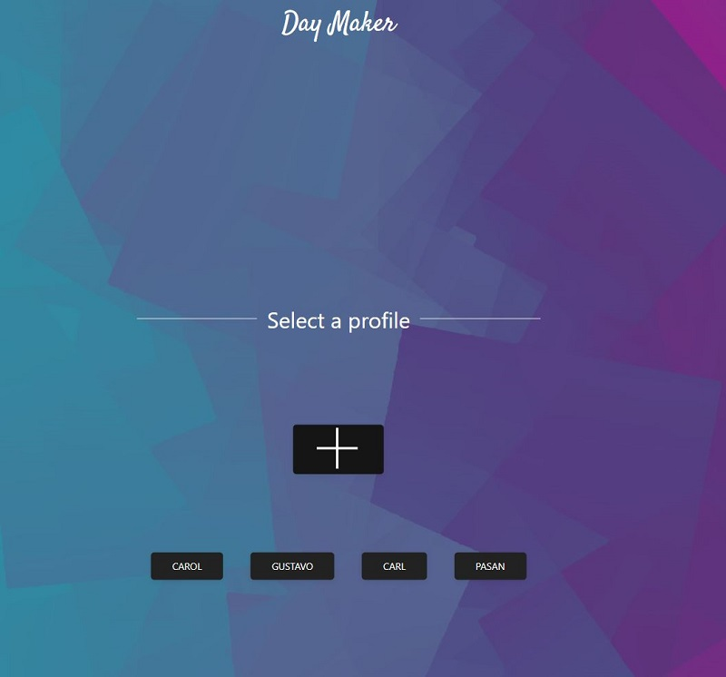

## Project 1 - Day Maker

Live Application Link 👀 **https://caz1502.github.io/Magpies-Project-1/ **

## Your Task

You and your group will use everything you’ve learned over the past six units to create a real-world front-end application that you’ll be able to showcase to potential employers. The user story and acceptance criteria will depend on the project that you create, but your project must fulfil the following requirements:

* Use a CSS framework other than Bootstrap.
* Be deployed to GitHub Pages.
* Be interactive (i.e., accept and respond to user input).
* Use at least two [server-side APIs](https://coding-boot-camp.github.io/full-stack/apis/api-resources).
* Does not use alerts, confirms, or prompts (use modals).
* Use client-side storage to store persistent data.
* Be responsive.
* Have a polished UI.
* Have a clean repository that meets quality coding standards (file structure, naming conventions, follows best practices for class/id naming conventions, indentation, quality comments, etc.).
* Have a quality README (with unique name, description, technologies used, screenshot, and link to deployed application).

## Presentation Requirements

* Elevator pitch: a one minute description of your application
* Concept: What is your user story? What was your motivation for development?
* Process: What were the technologies used? How were tasks and roles broken down and assigned? What challenges did you encounter? What were your successes?
* Demo: Show your stuff!
* Directions for Future Development
* Links to the deployed application and the GitHub repository

## User Story

As Uni Student, I want an app that provides infomation on news,weather and some humour at a glance. This allows me to plan my date with upto date information.

Benefit: I have a webpage to make my day :) 

## Acceptance Criteria - Update the acceptance Criteria

GIVEN 
WHEN I land on the landing page
THEN I promted to create a profile
WHEN I enter the main page
THEN I see jokes and news based on my profile settings
WHEN I click on a button in the joke section
THEN a new joke is refreshed on the page
WHEN I look for the local temperature
THEN I see my local weather based on my I.P location
WHEN I revisit the page
THEN I prompted to click on my profile to take me to my profile page

## Technologies Used

HTML ( UIKIT / TAILWIND )
JAVA SCRIPT / JQUERY
CSS
API

## Team Profile

The Remarkable Magpies 

## Wireframe

 

## Website Image

## Authors, Acknowledgement, & Resources 🤝
Teaching Crew at UniSA Coding Bootcamp 🎉
W3Schools 🤓
GitHub 
Youtube
Google
StackOverflow
